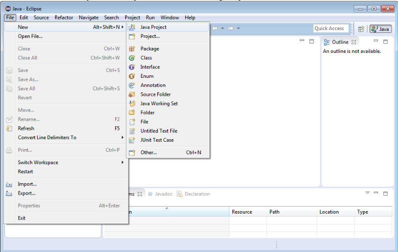
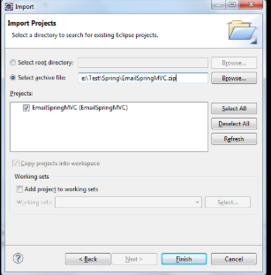
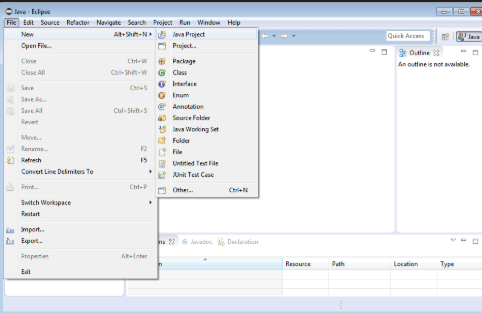

# CCRM - College Course Registration Management System

## Project Overview

CCRM is a comprehensive Java-based College Course Registration Management System that provides functionality for managing students, courses, enrollments, and academic transcripts. The system demonstrates advanced Java programming concepts including object-oriented design, exception handling, file I/O operations, and stream processing.

### How to Run

**Prerequisites:**
- JDK 11 or higher (recommended: Oracle JDK 17 or OpenJDK 17)
- Eclipse IDE (2023-03 or later) or IntelliJ IDEA
- Minimum 4GB RAM, 2GB free disk space

**Commands:**
```bash
# Compile the project
javac -d bin -cp src src/edu/ccrm/cli/MainMenu.java

# Run the main application
java -cp bin edu.ccrm.cli.MainMenu

# Run with assertions enabled
java -ea -cp bin edu.ccrm.cli.MainMenu

# Run with custom data folder
java -Ddata.folder=./custom-data -cp bin edu.ccrm.cli.MainMenu
```

## Evolution of Java

- **1995**: Java 1.0 - Initial release by Sun Microsystems
- **1997**: Java 1.1 - Inner classes, reflection, JDBC
- **1998**: Java 1.2 (J2SE) - Collections framework, Swing GUI
- **2000**: Java 1.3 - HotSpot JVM, JNDI
- **2002**: Java 1.4 - Assertions, NIO, logging API
- **2004**: Java 5.0 - Generics, annotations, autoboxing, enhanced for-loop
- **2006**: Java 6 - Performance improvements, compiler API
- **2011**: Java 7 - Try-with-resources, diamond operator, strings in switch
- **2014**: Java 8 - Lambda expressions, streams, Optional, default methods
- **2017**: Java 9 - Modules (Project Jigsaw), JShell
- **2018**: Java 10 - Local variable type inference (var)
- **2018**: Java 11 - LTS version, HTTP client API
- **2019**: Java 12-13 - Switch expressions, text blocks (preview)
- **2020**: Java 14-15 - Records (preview), pattern matching
- **2021**: Java 16-17 - Records finalized, sealed classes, LTS version
- **2022-2024**: Java 18-21 - Virtual threads, pattern matching enhancements

## Java Editions Comparison

| Feature | Java ME (Micro Edition) | Java SE (Standard Edition) | Java EE (Enterprise Edition) |
|---------|------------------------|---------------------------|------------------------------|
| **Target Platform** | Mobile devices, embedded systems | Desktop applications, standalone apps | Enterprise web applications |
| **Memory Footprint** | Very small (< 1MB) | Moderate (50-200MB) | Large (100MB+) |
| **Core APIs** | Limited subset | Full Java APIs | SE + Enterprise APIs |
| **GUI Support** | MIDP, LWUIT | Swing, JavaFX, AWT | Web-based (JSF, JSP) |
| **Database** | Basic RMS | JDBC | JPA, EJB, advanced ORM |
| **Networking** | HTTP, sockets (limited) | Full networking APIs | Web services, REST, SOAP |
| **Security** | Basic sandbox | Comprehensive security | Enterprise security, JAAS |
| **Use Cases** | IoT devices, feature phones | Desktop apps, utilities | Web apps, microservices |
| **Examples** | Nokia apps, smart cards | NetBeans, Eclipse | Banking systems, e-commerce |

## JDK/JRE/JVM Explanation

```
┌─────────────────────────────────────┐
│              JDK                    │
│  ┌─────────────────────────────┐    │
│  │            JRE              │    │
│  │  ┌─────────────────────┐    │    │
│  │  │        JVM          │    │    │
│  │  │  - Bytecode Exec.   │    │    │
│  │  │  - Memory Mgmt      │    │    │
│  │  │  - Garbage Collect. │    │    │
│  │  └─────────────────────┘    │    │
│  │  + Core Libraries (java.*)  │    │
│  │  + Runtime Classes          │    │
│  └─────────────────────────────┘    │
│  + Development Tools (javac, jar)   │
│  + Documentation & Headers          │
└─────────────────────────────────────┘
```

- **JVM (Java Virtual Machine)**: Executes bytecode, manages memory, handles garbage collection
- **JRE (Java Runtime Environment)**: JVM + core libraries needed to run Java applications
- **JDK (Java Development Kit)**: JRE + development tools (compiler, debugger, documentation)

## Installation Guide

### Windows JDK Installation

1. **Download JDK**
    - Visit [Oracle JDK](https://www.oracle.com/java/technologies/downloads/) or [OpenJDK](https://openjdk.org/)
    - Download Windows x64 installer

2. **Install JDK**
    - Run the installer as administrator
    - Follow installation wizard
    - Note installation path (e.g., `C:\Program Files\Java\jdk-17`)

3. **Set Environment Variables**
    - Open System Properties → Advanced → Environment Variables
    - Add `JAVA_HOME`: `C:\Program Files\Java\jdk-17`
    - Update `PATH`: Add `%JAVA_HOME%\bin`

4. **Verify Installation**
   ```bash
   java -version
   javac -version
   ```

   

### Eclipse IDE Setup

1. **Download Eclipse**
    - Visit [Eclipse Downloads](https://www.eclipse.org/downloads/)
    - Download Eclipse IDE for Java Developers

2. **Install and Configure**
    - Extract Eclipse to desired location
    - Launch Eclipse and select workspace
    - Go to Window → Preferences → Java → Installed JREs
    - Verify correct JDK is selected

3. **Create New Project**
    - File → New → Java Project
    - Enter project name: "CCRM"
    - Select JDK version (11+)
    - Configure build path if needed

   

4. **Import Existing Project**
    - File → Import → General → Existing Projects into Workspace
    - Browse to CCRM project folder
    - Select project and click Finish

   

## Project Structure & Syllabus Mapping

| Syllabus Topic | File/Class | Method/Concept | Description |
|----------------|------------|----------------|-------------|
| **Main Method & CLI** | `edu.ccrm.cli.MainMenu` | `main()`, `start()` | Application entry point, menu system |
| **Classes & Objects** | `edu.ccrm.domain.Student` | Constructor, getters/setters | Student entity with encapsulation |
| **Builder Pattern** | `edu.ccrm.domain.Course.Builder` | `code()`, `title()`, `build()` | Fluent API for object creation |
| **Enums** | `edu.ccrm.domain.Grade` | `S, A, B, C, D, F` | Grade enumeration with points |
| **Enums Advanced** | `edu.ccrm.domain.Semester` | `SPRING, FALL, SUMMER` | Semester enumeration |
| **Collections (List)** | `StudentService`, `CourseService` | `listAll()`, `ArrayList` | Student and course management |
| **Collections (Map)** | `MainMenu.showGpaDistribution()` | `HashMap<String, Double>` | GPA tracking and distribution |
| **Optional Class** | `StudentService.findByRegNo()` | `Optional<Student>` | Null-safe object handling |
| **Stream API** | `MainMenu.manageEnrollments()` | `filter()`, `toList()` | Filtering ungraded enrollments |
| **Stream Collectors** | `MainMenu.showGpaDistribution()` | `groupingBy()`, `counting()` | GPA distribution grouping |
| **Lambda Expressions** | `MainMenu.showGpaDistribution()` | `forEach()`, arrow functions | Functional programming |
| **Exception Handling** | `edu.ccrm.exceptions.*` | Try-catch blocks | Custom exceptions (DuplicateEnrollment) |
| **File I/O (NIO)** | `MainMenu.performBackup()` | `Files.copy()`, `DirectoryStream` | File operations and backup |
| **Recursion** | `edu.ccrm.util.RecursionUtil` | `calculateDirectorySize()` | Recursive directory traversal |
| **Configuration** | `edu.ccrm.config.AppConfig` | Singleton pattern | Application configuration |
| **Service Layer** | `edu.ccrm.service.*` | Business logic separation | Service-oriented architecture |
| **Switch Expressions** | `MainMenu.start()` | `case "1" ->` | Modern switch syntax (Java 14+) |
| **Record Classes** | `edu.ccrm.domain.Name` | Immutable data carriers | Modern Java record syntax |
| **Import/Export** | `edu.ccrm.io.ImportExportService` | CSV file processing | Data persistence |
| **Transcript Generation** | `edu.ccrm.service.TranscriptService` | `generateTranscript()` | Report generation |

## Running with Assertions

Assertions help validate program correctness during development:

### Enable Assertions
```bash
# Enable all assertions
java -ea edu.ccrm.cli.MainMenu

# Enable assertions for specific package
java -ea:edu.ccrm... edu.ccrm.cli.MainMenu

# Enable assertions for enrollment service
java -ea:edu.ccrm.service.EnrollmentService edu.ccrm.cli.MainMenu

# Disable assertions (default in production)
java -da edu.ccrm.cli.MainMenu
```

### Sample Assertion Commands
```bash
# Run CCRM with assertions enabled
java -ea -cp bin edu.ccrm.cli.MainMenu

# Run with system assertions and custom data folder
java -esa -ea -Ddata.folder=./test-data -cp bin edu.ccrm.cli.MainMenu

# Run with assertions for enrollment validation
java -ea:edu.ccrm.service.EnrollmentService -cp bin edu.ccrm.cli.MainMenu
```

### Assertion Examples in CCRM
```java
// Credit limit validation
assert totalCredits <= maxCredits : "Total credits exceed limit: " + totalCredits;

// Student registration validation
assert regNo != null && !regNo.isEmpty() : "Registration number cannot be empty";

// Grade point validation
assert grade.getPoints() >= 0.0 && grade.getPoints() <= 10.0 : "Invalid grade points";
```

## Application Features

### 1. Student Management
- **Add Students**: Register new students with RegNo, Name, and Email
- **List All Students**: Display complete student roster
- **Search by Name**: Find students using partial name matching
- **Update Student**: Modify student email addresses

### 2. Course Management
- **Add Courses**: Create courses with code, title, credits, and department
- **List All Courses**: View complete course catalog
- **Search/Filter**: Filter courses by department
- **Builder Pattern**: Uses Course.Builder for flexible object creation

### 3. Enrollment & Grading
- **Student Enrollment**: Enroll students in courses with validation
- **Credit Limit Checking**: Prevents over-enrollment based on max credits
- **Grade Assignment**: Assign grades (S/A/B/C/D/F) to enrolled students
- **Duplicate Prevention**: Prevents duplicate enrollment in same course

### 4. Reports & Analytics
- **Transcript Generation**: Complete academic transcript for students
- **GPA Distribution**: Statistical analysis of student performance
- **GPA Calculation**: Weighted GPA based on credits and grade points

### 5. Data Management
- **Import/Export**: CSV-based data import and export functionality
- **Backup System**: Automated backup with size calculation
- **Data Persistence**: File-based storage in configurable data folder


## Usage Guide

### Quick Start
```bash
# Clone/download CCRM project
git clone [your-repo-url]

# Compile all source files
javac -d bin -cp src src/edu/ccrm/cli/MainMenu.java

# Run CCRM application
java -cp bin edu.ccrm.cli.MainMenu
```

### Sample Commands & Operations
```bash
# Run with custom configuration
java -Ddata.folder=./custom-data -Dmax.credits=24 -cp bin edu.ccrm.cli.MainMenu

# Run with debug output
java -ea -verbose:gc -cp bin edu.ccrm.cli.MainMenu

# Generate transcript for specific student
# (Use option 4 in menu, then enter RegNo)

# Perform system backup
# (Use option 6 in menu - creates timestamped backup folder)
```

### Test Data Files Structure
```
test-data/
├── students.csv          # Sample student records (RegNo, FirstName, LastName, Email)
├── courses.csv           # Course catalog (Code, Title, Credits, Department, Semester)
├── enrollments.csv       # Enrollment data (StudentRegNo, CourseCode, Grade)
└── config.properties     # Application configuration settings
```

### Sample CSV Formats

**students.csv:**
```csv
RegNo,FirstName,LastName,Email
CS001,John,Doe,john.doe@university.edu
CS002,Jane,Smith,jane.smith@university.edu
CS003,Bob,Johnson,bob.johnson@university.edu
```

**courses.csv:**
```csv
Code,Title,Credits,Department,Semester
CS101,Programming Fundamentals,4,Computer Science,SPRING
CS102,Data Structures,4,Computer Science,FALL
MATH201,Calculus I,3,Mathematics,SPRING
```


